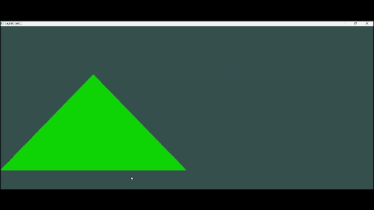

# cpp-opengl-pipeline

  

## 🚀 Overview
A ground-up implementation of a rendering engine built to master the **OpenGL Programmable Pipeline**.

**Context:** Developed as an **Independent Research Project** during my second year as a Software Engineer. The goal was to move beyond high-level abstractions (like VTK/Ansys) and understand the low-level interaction between CPU instructions and GPU rasterization, specifically focusing on **Shader Architecture** and **Memory Management** (VBO/VAO).

## 📸 Output Demo
| GUI View
| :---:
| 

## 🔧 Key Technical Concepts
This project implements the core stages of the GPU rendering pipeline:

* **Vertex Specification:**
    * Implementation of **Vertex Array Objects (VAOs)** and **Vertex Buffer Objects (VBOs)** to efficiently push geometry data to GPU memory.
    * Understanding **Stride & Offset** memory layouts for interleaved vertex attributes (Position, Color, Texture Coords).
* **The Programmable Pipeline (GLSL):**
    * **Vertex Shader:** Handling `gl_Position` and transformation matrices (Model-View-Projection).
    * **Fragment Shader:** Pixel-level manipulation for color interpolation and texture sampling.
* **Mathematics (GLM):**
    * usage of **GLM (OpenGL Mathematics)** for vector/matrix operations.
    * Implementation of a **Camera Class** using Euler Angles (Pitch/Yaw) and LookAt matrices.

## 🛠️ Build Environment
**Tech Stack:**
* **Language:** C++17
* **Graphics API:** OpenGL 3.3 Core Profile
* **Windowing:** GLFW 3.3
* **Extension Loader:** GLAD / GLEW
* **Math:** GLM

